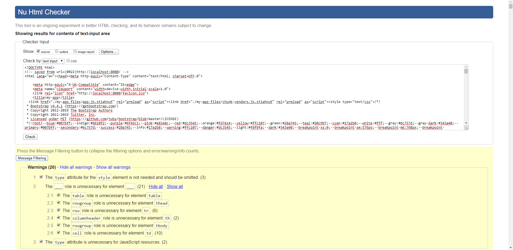
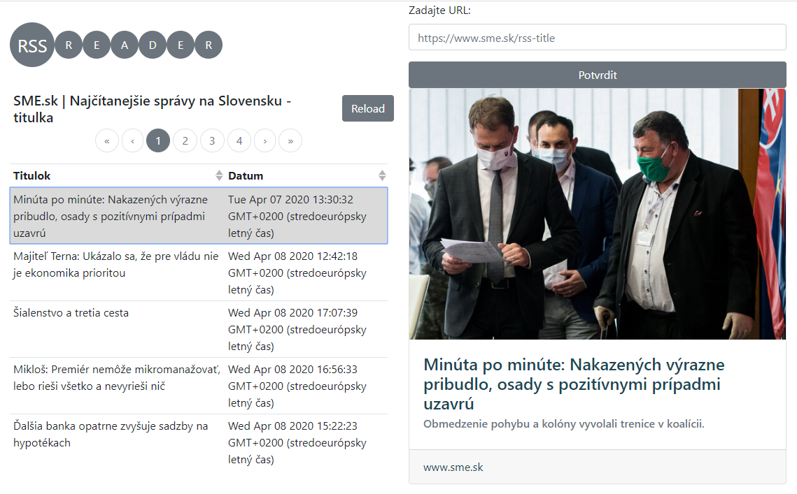

# RSS Reader

**Vypracoval:** Tomáš Babjak

**Vyvojove prostredie:** Vue.js, Bootstrap-Vue

------

## Zadanie 2 - CI/CD

**Platform:** GitHub Pages

**CI/CD:** Travis CI

**Github branch with page built:** gh-pages

**URL:** https://tomasbabjak.github.io/rss-reader/

Zverejnenie stránky sme zabezpečili pomocou **GitHub Pages**, automatické akualizovanie a CI/CD stránky cez **Travis CI**.
Po každom spustení akcie **git push** nad adresárom so zdrojovým kódom stránky sa nanovo vybuduje stránka vo vetve **gh-pages**. Súbory slúžiace na CI/CD sú `travis.yml` a `deploy.sh`.
Pri práci na tejto časti zadania sme sa riadili návodom na stránke https://cli.vuejs.org/guide/deployment.html#github-pages

------

## Zadanie 1 - RSS Reader

Projekt prezentovany 2.4.2020, splnene vsetky poziadavky okrem W3C Validatora

Dokaz o bezchybnom validovani zaslany na mail plus tu:



Screenshot RSS Reader:



Final HTML code of website:

[HTML code](my-app.html)

## Project setup
```
npm install
```

### Compiles and hot-reloads for development
```
npm run serve
```
